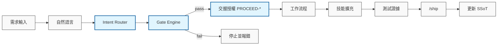
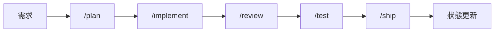

# AgentCortex v5.3 (Runtime v5 Anti-Drift Edition)

[English Version](README.md)

> **從「流程驅動」進化到「自我管理」的專業級 AI Agent 核心架構。**

## 🎯 專案定位

**AgentCortex** 是一個專為頂尖開發者（使用 Gemini 3.1 Pro/3 Flash, Claude Opus 4.6, 或 GPT-4o）設計的高效能**結構化認知框架**。它能幫助 AI Agent 深度理解代碼庫、嚴格遵守工程護欄，並以極高的 Token 效率執行複雜任務。

我們對齊並優化了 Google Antigravity / Codex Web / Codex App 的使用情境：

- **Self-Managed**：AI 自行分類任務並套用對應的治理閘門。
- **Runtime v5 Anti-Drift**：具備強制防跳步驟的 `Gate Engine` 與 `Handshake` 交握機制，封鎖幻覺越權。
- **Concurrency & Migration Safe**：內建多人協作 Metadata 防撞車與舊專案無痛導入的 `/audit` 工作流。
- **Token Optimized**：針對不同風險等級自動調整治理強度，`tiny-fix` 走 fast-path 以節省成本。
- **Command-first**：用標準化指令觸發 Agent 能力，確保行為一致性。
- **10 不可違反原則**：[設計哲學](.agentcortex/docs/AGENT_PHILOSOPHY_zh-TW.md)定義 P1-P10 核心信條 — AI 主導、不跳步驟、憲法高於任務、無證據不完成、跨模型合規。
- **命名空間隔離**：下游專案可自由添加自定義 skill 和 workflow，框架用 `.agentcortex-manifest` 區分管理範圍，用戶指令永遠優先。
- **12 項自動觸發技能**：每個 skill metadata 都宣告在哪個 phase 自動啟用，AI 不需要人類提示就知道何時使用。

## 🔗 參考來源

- Superpowers 專案（理念參考）：<https://github.com/obra/superpowers>
- 專案導入範例：`.agentcortex/docs/PROJECT_EXAMPLES_zh-TW.md`
- 遷移與整合指南：`.agentcortex/docs/guides/migration_zh-TW.md`
- Token 治理指南：`.agentcortex/docs/guides/token-governance_zh-TW.md`

## 📦 目錄總覽

- `.agent/rules/engineering_guardrails.md`：工程憲法（含分類規則與 Gate 標準）
- `.agent/workflows/*.md`：單檔工作流程（bootstrap, plan, implement, handoff, ship 等）
- `.agent/skills/<skill>/SKILL.md`：技能檔（Codex 相容路徑：`.agents/skills`）
- `.agentcortex/context/current_state.md`：全域唯讀狀態（SSoT）
- `.agentcortex/context/work/`：任務隔離 Work Log
- `.agentcortex/adr/`：架構決策記錄
- `.agentcortex/docs/CODEX_PLATFORM_GUIDE_zh-TW.md`：Codex 平台指南
- `AGENTS.md`：跨平台長期指令入口

## 🧩 系列功能對照 (Superpowers Based)

| 功能 | 指令 | 對應檔案 | 目的 |
| :--- | :--- | :--- | :--- |
| 任務啟動 | `/bootstrap` | `.agent/workflows/bootstrap.md` | 固定目標、限制與 AC，凍結分類 |
| 頭腦風暴 | `/brainstorm` | `.agent/workflows/brainstorm.md` | 快速發散方案並收斂 |
| 探索研究 | `/research` | `.agent/workflows/research.md` | 補齊未知與限制 |
| 規格定義 | `/spec` | `.agent/workflows/spec.md` | 產出可驗收規格 |
| 任務規劃 | `/plan` | `.agent/workflows/plan.md` | 先規劃再動手 |
| 實作執行 | `/implement` | `.agent/workflows/implement.md` | 安全實作、可回退 |
| 代碼審查 | `/review` | `.agent/workflows/review.md` | 風險與品質檢查 |
| 回顧精進 | `/retro` | `.agent/workflows/retro.md` | 形成可複用經驗 |
| 交接摘要 | `/handoff` | `.agent/workflows/handoff.md` | 跨回合核心：保留決策脈絡 |
| 決策記錄 | `/decide` | `.agent/workflows/decide.md` | 記錄關鍵決策與推理，防止跨回合重複推導 |
| 測試分類 | `/test-classify` | `.agent/workflows/test-classify.md` | 依任務分類自動選擇測試深度與證據格式 |
| 最終交付 | `/ship` | `.agent/workflows/ship.md` | 彙整提交證據與歸檔狀態 |
| 規格匯入 | `/spec-intake` | `.agent/workflows/spec-intake.md` | 匯入並拆解多功能外部規格 |
| 架構決策 | `/adr` | `.agent/workflows/adr.md` | 建立架構決策記錄 |
| 外部委派 (自然語言) | `ask-openrouter` | `.agent/workflows/ask-openrouter.md` | [可選] 將任務委派給 OpenRouter 模型 |
| Codex CLI 執行 | `codex-cli` | `.agent/workflows/codex-cli.md` | [可選] 透過 Codex CLI 安全執行任務 |

## 🔀 Antigravity / Codex 路徑差異

- Antigravity 主要讀取：`.agent/skills` (Native Agent 核心能力)
- Codex 主要掃描：`.agents/skills` (Codex App 專屬能力)
- **注意**：兩者目錄獨立存在以適應不同平台配置。若需共用，請根據需求手動鏡像或建立軟連結。

## 🛡️ 規則檔與安全邊界

- `.antigravity/rules.md`：Antigravity 優先讀取的規則總表。
- `.agent/rules/rules.md`：舊版相容副本，內容同步。
- `codex/rules/default.rules`：Codex 規則擴充入口。
- `AGENTS.md`：跨平台長期指令，引用 `engineering_guardrails.md`。

### Runtime v5 執行守門員 (Anti-Drift Engine)

這套機制防止 AI 繞過授權與工作流程，確保每一次操作都具備證據與手動確認。



### 高風險指令安全設定

以下命令預設禁止直接執行，需先提出風險與回退方案：

- `rm -rf`、`git reset --hard`、`git clean -fdx`
- `docker system prune -a`、`chown -R`、`curl ... | bash`、`chmod -R 777`

## 🚀 快速開始

### 1) 部署到專案

```bash
./deploy_brain.sh /path/to/your-project
```

> [!TIP]
> 部署腳本會自動將 Agent 相關暫存檔（如 `work/`, `skills/` 等）加入 `.gitignore`，防止其被上傳到遠端倉庫。

### 2) Codex / Antigravity 開場

```text
Fetch and follow instructions from <your-raw-url>/.codex/INSTALL.md
```

> 若遇到 403 錯誤，請直接貼上 `.codex/INSTALL.md` 全文。

### 3) 任務開場提示（從零開始）

```text
請先執行 /bootstrap。
需求：[一句話]
目標檔案：[path1, path2]
限制：[不可改 API / 不可改 schema]
驗收：[列 2-3 點可驗收條件]
```

### 4) 帶入前期討論素材（已與其他 AI 討論過）

若已與其他 AI 模型完成規格討論、白皮書、技術文件等，不需要先自行整理——直接貼入即可，AI 會自行提取與歸檔。

```text
請先執行 /bootstrap。
需求：[一句話總結]
以下是前期討論的完整內容，請先消化後再開始規劃：
---
[直接貼上所有素材：對話記錄、規格書、技術文件等]
---
```

> AI 會在 bootstrap 過程中自動：提取需求與限制 → 整理存入 `.agentcortex/specs/` → 分類任務 → 輸出標準 bootstrap 結果。

### 5) 跨回合交接提示（續做任務時使用）

```text
以下是前一個模型留下的 handoff，請以此為「唯一真實狀態」繼續工作。
你不得重新設計、不得調整 scope，只能依此 handoff 完成你的任務。
[貼上 handoff 內容]
```

### 6) 用指令驅動開發

1. `/bootstrap`：初始化任務並凍結分類
2. `/plan`（或 `/write-plan`）：列檔案、步驟、風險、回退
3. `/implement`（或 `/execute-plan`）：只改已同意範圍
4. `/review`：做嚴格自審
5. `/test`：列並執行最小必要驗證
6. `/handoff`：跨回合交接（非 tiny-fix 必須）
7. `/ship`：整理 commit / 變更摘要 / 測試結果

## ⚙️ 建議節奏



- **小修補（tiny-fix）**：`classify → do → inline evidence → done`
- **一般修補**：`/plan → /implement → /review → /test`
- **新功能**：`/brainstorm → /spec → /plan → /implement → /review → /test`
- **緊急修復**：`/research → /plan → /implement → /review → /test`

## 🧠 Token Hygiene（避免小任務放大成本）

- 任務啟動只讀：`.agentcortex/context/current_state.md` 與 `.agentcortex/context/work/<branch>.md`。
- 優先精準檢索（`rg <keyword> <path>`），避免全樹掃描。
- 先用 `/plan` 收斂檔案範圍，再進入 `/implement`，降低來回修正。
- 小型任務沿用 Fast Lane；若變更開始影響狀態/策略，立即升級流程，避免返工。

## ✅ 自我驗證

```bash
.agentcortex/bin/validate.sh
```

完整平台建議請見 `.agentcortex/docs/CODEX_PLATFORM_GUIDE_zh-TW.md`。

---
詳細變更請見 [CHANGELOG.md](./CHANGELOG.md)

## Windows（無 bash）部署補充

若你的 Windows 環境沒有 `bash`，可使用專案根目錄的 wrapper：

- PowerShell：`powershell -ExecutionPolicy Bypass -File .\deploy_brain.ps1 .`
- CMD：`deploy_brain.cmd .`

這兩個 wrapper 會轉呼叫 `deploy_brain.sh`，因此仍需要安裝 Git Bash 或 WSL。

