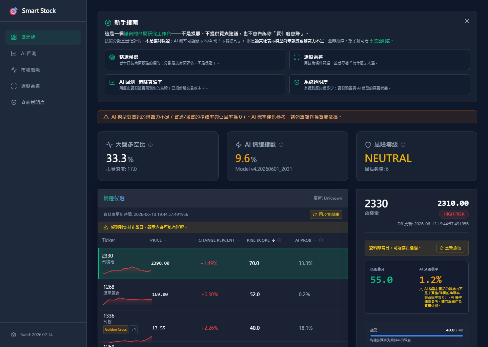
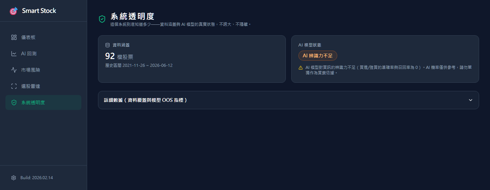
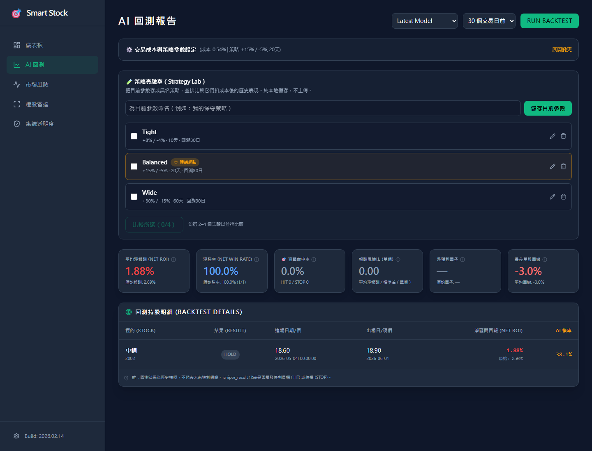

# Smart Stock 🎯 — an honest little Taiwan-stock tool

**繁體中文**: [README.md](README.md)

A Taiwan stock (TWSE / TPEX) research workbench I built for myself and figured I'd share. It's an open-source, self-hostable tool that runs offline with one command, and only holds itself to one rule: **honesty**. It doesn't hand out stock tips, and when the AI genuinely doesn't know, it says **N/A** instead of making up a number. You can also re-run the entire data pipeline yourself and see exactly how the sausage is made.

> ⚠️ This is a research/learning tool, **not investment advice and not a stock-tip machine**. Profits and losses are on you — don't bet the house on it.

## What's inside

| Page | In plain words |
| :--- | :--- |
| 🎯 **Dashboard** | Today's more interesting stocks by technical signals, with an explanation of *why* — not a buy call, just the signal |
| 🧪 **Strategy Lab** | Save your backtest parameters as named strategies and compare them side by side — real net-of-cost performance (fees + tax deducted), no cherry-picking a winner |
| 🔍 **Stock Screener (選股雷達)** | Filter stocks by technical conditions, each with a "why it made the list" note |
| 🛡️ **System Transparency** | How much does this system actually know? Data coverage and model reliability, laid out plainly |
| 🧭 **Beginner Guide** | Fine if you know nothing — there's guided help; collapse it if you don't need it |

> **The honest part up front**: this repo doesn't ship a trained model (`.pkl` files are gitignored), so the demo's "AI probability" honestly shows **N/A**. Want a real model? Run `python scripts/setup_real_ai.py` to train one yourself — but fair warning, with small amounts of data the model will be pretty weak, and we don't hide that: `model_health` says so right in the UI. Want to reproduce the whole pipeline from scratch? `python scripts/reproduce_pipeline.py` (see [docs/REPRODUCE.md](docs/REPRODUCE.md)).

## What the "AI panel" actually is (no oversell)

The technical-summary panel you'll see per stock is a **hand-coded, rule-based summary** — KD, RSI, volume, and so on translated into plain language. It is not a trained model and not "AI reasoning," so we don't call it an AI analyst. The only place actual machine learning happens is the ensemble probability score, and that's exactly the part that honestly shows N/A until you train it yourself.

## Screenshots

All of these are real demo-mode screens with an untrained demo model — so the AI is upfront about its own "not reliable yet" state instead of pretending to know. (The screenshots were taken on the full dev database; a fresh clone's bundled offline demo is 15 tickers.)

**Dashboard**: candidate list with explainable signals per stock; the AI probability is labeled honestly when the model isn't up to the job.


**System Transparency**: data coverage and model reliability, all laid out in one place.


**Strategy Lab**: named, saved backtest strategies compared side by side.


## Quickstart (offline demo)

```bash
# macOS / Linux
./quickstart.sh

# Windows (PowerShell)
.\quickstart.ps1
```

This installs backend dependencies, loads a bundled offline demo dataset (`data/demo/demo_prices.csv`, a handful of tickers including TSMC) into `storage.db`, computes technical scores offline, builds the frontend, and prints the startup command. Then start everything with a single command on a single port:

```bash
python backend/main.py     # backend serves the built frontend → http://localhost:8000
```

No second terminal, no separate frontend port needed for normal use.

Want the full pipeline instead of the bundled demo data? See [docs/REPRODUCE.md](docs/REPRODUCE.md) and run:

```bash
python scripts/reproduce_pipeline.py
```

For day-to-day use there's also `daily_run.sh` / `daily_run.bat`, which syncs data, re-scores with whatever model you currently have, and updates the dashboard — no manual steps required.

## Under the hood

Roughly: a data layer pulls prices from yfinance/twstock (or TWSE/TPEX official bulk endpoints for faster full-market backfill) into a local SQLite database → a technical-analysis engine computes indicators and a Rise Score → an ensemble ML engine turns those into a probability score → FastAPI serves both to the React/Vite frontend. Everything runs locally; there's no external service dependency beyond the price-data sources.

## Tech stack

* **Backend**: FastAPI (Python)
* **Frontend**: React, TypeScript, Vite (Tailwind CSS)
* **Database**: SQLite (local, persistent)
* **Technical analysis**: Pandas / NumPy — KD, RSI (Wilder's), MACD, Bollinger Bands, ATR, and a heuristic Rise Score
* **Machine learning**: an ensemble of GradientBoosting + RandomForest + MLP, using the Rise Score as an expert feature, trained with strict walk-forward (time-series) validation to avoid leaking future data into the past

## Who this is for

If you want a self-hostable Taiwan stock screener with real backtesting, some machine learning under the hood, and full transparency about what the model can and can't do — this is that. If you want stock tips, this is not that; go read a prospectus instead.

## License

MIT License
