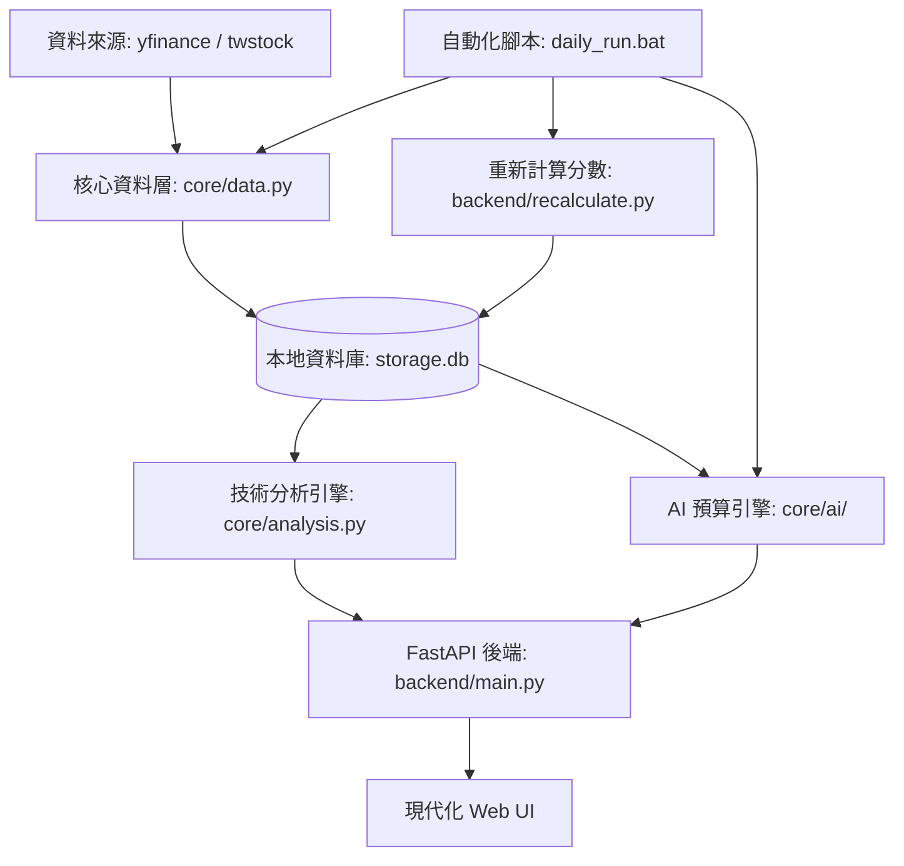
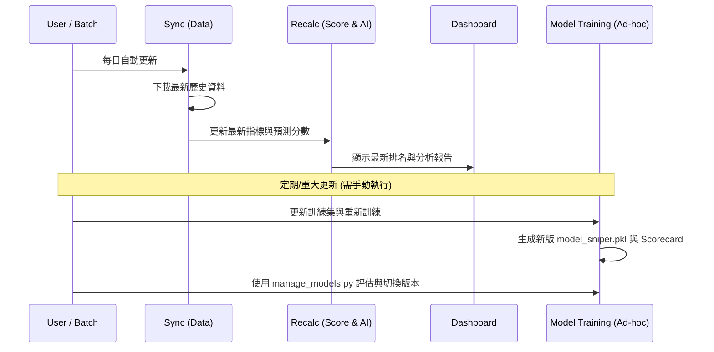

# Smart Stock 🚀 (智慧選股) - Open Source Version

這是一個專為台灣股市 (TWSE) 設計的技術分析儀表板與 AI 預測引擎。

## 🎯 核心理念：「狙擊手」策略

不同於單純預測漲跌的傳統模型，本系統採用 **三元演算法 (3-Class System)** 來鎖定高暴擊目標：

* **強勢獲利 (Strong Buy)**：在 20 個交易日內，股價先觸及 **+15%** (獲利點)，且過程中未曾觸及 **-5%** (停損點)。
* **穩健獲利 (Buy)**：在 20 個交易日內，股價觸及 **+10%** 且未停損。
* **觀望/停損 (Hold/Loss)**：觸發 -5% 停損，或 20 天內未達獲利目標。
* **AI 目標**：識別出「強勢獲利」與「穩健獲利」機率遠高於停損的訊號，在保護本金的同時追求高爆發性成長。

## 🏗️ 系統架構 (System Architecture)



## ⚙️ 運作流程 (Data Pipeline)



## 🛠️ 技術棧

* **後端 (Backend)**: FastAPI (Python)
* **前端 (Frontend)**: React, TypeScript, Tailwind CSS, Vite (V4 現代化玻璃擬態 UI)
* **資料庫 (Database)**: SQLite (本地持久化存儲)
* **技術分析 (Analysis)**: Pandas, NumPy, 包含 KD, RSI (Wilder's), MACD (Normalized), 布林通道, ATR 等指標
* **人工智慧 (AI/ML)**: Ensemble V4 (結合 GradientBoosting, RandomForest 與 MLP 深度學習模型，並整合 Heuristic Rise Score 作為專家特徵)

## 🚀 快速上手 (Quick Start)

> 建議第一次使用者直接走「每日自動更新」流程：安裝依賴 → 啟動系統 → 點擊 Sync Data。

### 1. 安裝環境

確保您的電腦已安裝 Python 與 Node.js (建議 v18+)，然後執行：

```bash
# 安裝後端核心依賴
pip install -r requirements.txt

# 安裝前端 V4 依賴
cd frontend/v4
npm install
```

### 2. 資料同步 (資料庫初始化)

下載台股約 1000 檔股票的歷史資料到本地資料庫：

```bash
# 方法 A: 啟動後在網頁點擊 "Sync Data" 按鈕（推薦）
# 方法 B: 直接啟動後端 API（伺服器啟動後可同步）
python backend/main.py
```

*(同步過程約需 10-15 分鐘，請耐心等候)*

### 3. 每日自動更新 (日常維運)

直接執行自動化腳本，系統會執行「資料同步 -> 利用現有AI進行預測 -> 分數重算」流程：

**Windows:**

```bash
./daily_run.bat
```

```bash
chmod +x daily_run.sh
./daily_run.sh
```

### 4. 模型重新訓練 (定期維護)

當策略規則改變（例如修改 `config.py` 的目標與停損），或您希望模型吸收最新的幾個月的市場數據時，才需要手動執行：

```bash
python backend/train_ai.py
```

*(執行完畢後會生成版本化模型檔案並同步生成效能評分卡)*

### 5. 模型管理 (Model Management)

系統提供專屬 CLI 工具來評估與操作多個模型版本：

```bash
# 列出所有模型版本及其效能指標 (Acc, Profit Factor, Win Rate)
python backend/manage_models.py list

# 切換到指定模型版本
python backend/manage_models.py activate v4.20260225_1409

# 自動清理舊模型，僅保留績效前 5 名
python backend/manage_models.py prune --keep=5
```

*(注意：切換模型後需重啟後端伺服器以載入新模型)*

### 6. 介面操作說明

* **🔄 Sync Data 按鈕**: 這是您的「數據心臟更新鍵」。點擊後，系統會即時從網路抓取最新的成交價，並利用現有的 AI 模型進行預測。適合在盤中或收盤後立即查看最新狀態。
* **🎯 狙擊手實戰觀察手冊**: 在儀表板中間新增了實戰指南，包含 **AI 共識檢核**、**技術面關聯性**與**大盤系統風險**三大量化觀察點，協助您分析訊號強度。

### 7. 分步手動執行 (選用)

如果您想手動控制流程：

1. **資料同步**: `python backend/main.py --sync`
2. **分數重算**: `python backend/recalculate.py`

### 8. 啟動系統 (儀表板)

開發環境下，您需要同時啟動後端 API 伺服器與前端 Vite 開發伺服器。

**啟動後端伺服器 (終端機 1)：**

```bash
python backend/main.py
```

**啟動前端伺服器 (終端機 2)：**

```bash
cd frontend/v4
npm run dev
```

訪問網址：`http://localhost:5173/`

### 常見啟動問題 (Troubleshooting)

* **前端打不開 (`localhost:5173`)**：請確認是否在 `frontend/v4` 目錄下執行 `npm run dev`。
* **後端報依賴錯誤**：請重新執行 `pip install -r requirements.txt`。
* **同步卡很久**：首次同步通常 10–15 分鐘，屬正常行為；可先確認網路是否可連到 yfinance 資料源。

## ✨ 亮點功能 (Feature Highlights)

| 功能 | 說明 |
| :--- | :--- |
| **Ensemble V4 AI** | 結合三種異質機器學習模型 (GB, RF, MLP)，並整合 **Rise Score** 技術指標分數作為訓練特徵，大幅提升預測穩定性。 |
| **Time-Series Split** | 訓練模型採用嚴格的「時間序列漫步驗證 (Walk-Forward Validation)」，切分 80/20 時間軸，完全杜絕傳統交叉驗證「用未來預測過去」的資料外洩 (Data Leakage) 漏洞。 |
| **Model Versioning** | 完整模型版本管理系統，自動追蹤訓練版本與同步時間，確保 UI 排名與策略回測結果 100% 一致。 |
| **Smart Sync 2.0** | 偵測模型更新或資料過期 (>6h) 自動觸發同步。並行同步技術 (`ThreadPoolExecutor`) 達成 10 倍速。 |
| **Stability Plus** | 啟用 SQLite WAL 模式與並行鎖定處理，確保在高強度同步與 API 請求同時發生時系統依然穩定不噴錯。 |
| **Backtest Lab** | 「時光機」功能。採用**大樣本搜尋 (300 檔)** 與**歷史機率排序**，真實模擬 AI 歷史選股表現 (精準對齊市場交易日)。 |
| **True Sniper Exit** | 回測引擎內建「真實狙擊手出場」邏輯：一旦股價在模擬期間內觸及 +15% 目標或 -5% 停損，當天立即提早結算並鎖定報酬，真實反映紀律交易的勝率，而非強制抱到期滿。 |
| **指標快取系統** | 將預計算的技術指標存儲於 `stock_indicators` 表，大幅提升掃描與回測速度。 |
| **AI 虛擬分析師** | 自動生成技術面解釋報告，解析 AI 預測背後的邏輯。並加入全站 Global Tooltips 解釋各種金融專有名詞。 |
| **Price Signal Chart** | 每張 SniperCard 內嵌 90 天收盤價折線圖，並以彩色訊號點標注 AI 偵測到的 Squeeze（⚡黃）、Golden Cross（✦藍）、Volume Spike（▲紫），讓朋友秒懂 AI 在追蹤什麼。 |
| **AI Probability 動畫** | Score Breakdown 的 AI 勝率數字從 0 動態計數至實際值（ease-out cubic 動畫，~1 秒），強化 AI 計算感。 |
| **一鍵腳本** | `daily_run.bat` 讓每日資料更新與訓練變得極其簡單。 |

## 🧪 資料品質與回測可信度檢核 (Data Quality & Backtest Reliability)

為降低回測失真與資料偏差，系統採用以下防護：

* **調整後價格 (Adjusted Price)**: `fetch_stock_data` 使用 `yfinance.history(..., auto_adjust=True)`，降低除權息造成的價格跳空干擾。
* **資料時間序完整性**: 下載後資料會依 `date` 排序並去除重複日期，只保留最後一筆，避免同日重複資料影響指標。
* **無前視偏誤**: 回測僅以進場日當下資料計算 AI 機率與分數，並以固定持有視窗模擬後續結果。
* **績效摘要一致性**: `best_stock / best_return` 以「實際報酬最高」交易計算，不以 AI 排名第一名替代。

### 首頁入口讀取策略

後端 `GET /` 會依序嘗試以下檔案，確保部署時不因單一路徑缺失而白屏：

1. `frontend/index.html`
2. `frontend/index_legacy.html`
3. `frontend/v4/dist/index.html`
4. `frontend/v4/index.html`

若皆不存在，回傳 `404 Frontend entry file not found`。

## 🧠 AI Brain & 協作規範 (AI Brain & Collaboration)

本專案採用 **AI Brain Template v3.4.1 (Antigravity Superpowers Edition)** 進行架構治理，確保 AI 與人類開發者在高度一致的「工程憲法」下協作。

### 核心工作流

本專案遵循 [Superpowers](https://github.com/obra/superpowers) 的設計哲學，透過結構化的任務引導（如 `/bootstrap`, `/plan`, `/review`）確保代碼質量與安全。

### 憲法與品質

AI 助手在執行任務時，必須嚴格遵守專案內嵌的工程憲法與 [測試協議](docs/TESTING_PROTOCOL.md)，以維持系統的穩定性與可解釋性。

## 📜 授權條款

MIT License
