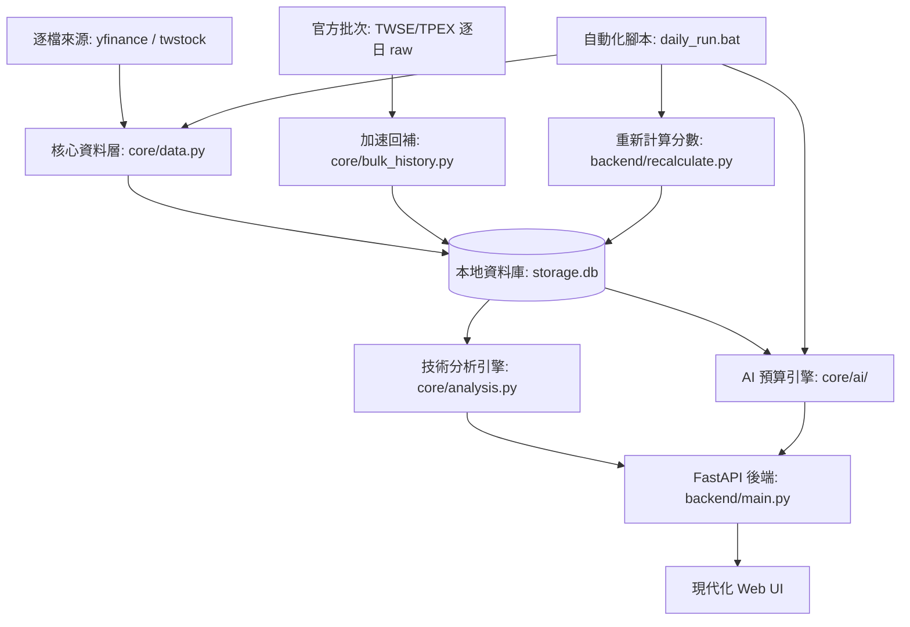
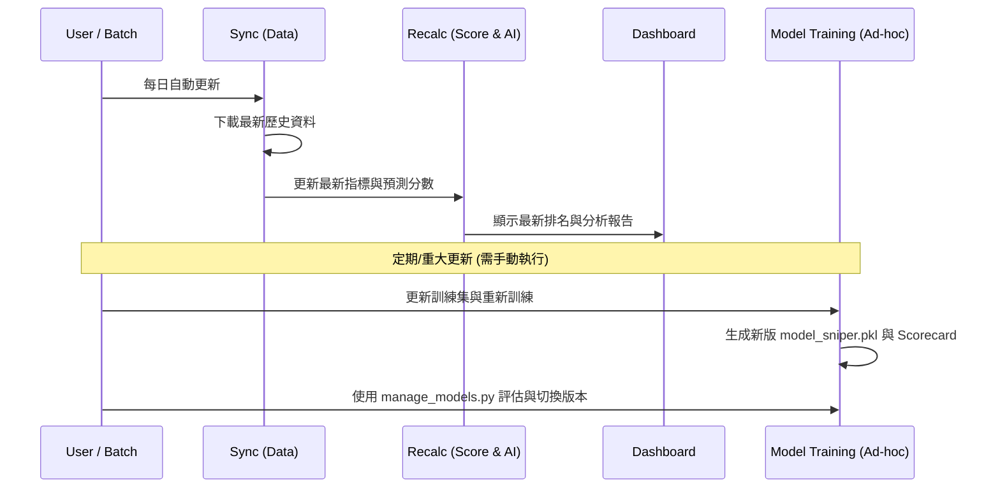

# Smart Stock 🎯 (智慧選股) — 一個誠實的台股小工具

自己做來玩、順手放上來分享的台股（TWSE / TPEX）研究小工具。只堅持一件事：**誠實**。不報明牌、不唬爛，AI 不會的時候就老實說「我不知道」，不會硬掰一個數字騙你。可以離線一鍵開來玩，也能自己架，甚至把整條 pipeline 從頭跑一遍看門道。

### ✨ 裡面有什麼
| 頁面 | 白話說 |
| :--- | :--- |
| 🎯 **儀表板** | 今天技術面比較有戲的股票，還會告訴你「為什麼」——不是叫你買，是給你看訊號 |
| 🧪 **策略實驗室** | 把你的回測參數存起來、擺一起比（扣完手續費稅金的真實績效，不美化、不選冠軍） |
| 🔍 **選股雷達** | 用技術條件篩股，每檔都附上「它為什麼上榜」 |
| 🛡️ **系統透明度** | 這系統到底知道多少？資料夠不夠、模型可不可靠，一次攤給你看 |
| 🧭 **新手指南** | 完全不懂也沒關係，有導引；老手嫌煩一鍵收起來就好 |

> **先講好**：repo 沒附訓練好的模型，所以 demo 的「AI 機率」會誠實顯示 **N/A**（對，就是這麼老實）。想要真的 AI？跑一行 `python scripts/setup_real_ai.py` 自己訓練——但醜話說前面，資料少的時候模型會很雷，我們也不藏，直接在畫面上標給你看。想把整條 pipeline 自己跑一遍：`python scripts/reproduce_pipeline.py`（詳見 [docs/REPRODUCE.md](docs/REPRODUCE.md)）。

> ⚠️ 這是研究／學習用的小工具，**不是投顧、也不是明牌機**。賺賠自負，別把身家壓上去。

## ⚡ 快速開始 (Quickstart — 離線 Demo)

想立刻看到「有資料的儀表板」？內建一份離線 demo 資料集（`data/demo/demo_prices.csv`，含台積電等數檔），**不需等待 yfinance 下載**：

```bash
# macOS / Linux
./quickstart.sh

# Windows (PowerShell)
.\quickstart.ps1
```

這會：安裝後端相依套件 → 把 demo 資料載入 `storage.db` 並離線算出技術分數 → **建置前端 UI** → 印出啟動指令。接著用**單一指令、單一網址**啟動：

```bash
python3 backend/main.py     # 前後端合一 → http://localhost:8000
# 或 ./start.sh （Windows: start.bat）：啟動伺服器並自動開啟瀏覽器
```

> 後端會直接服務已建置的前端,所以**只需要一個埠 `:8000`**,不必再開第二個終端機。
> （想要前端熱重載的開發者：`cd frontend/v4 && npm run dev` 仍可用,見下方「啟動系統」。）

> **誠實說明**：repo 不附帶已訓練的模型（`.pkl` 已 gitignore），所以 demo 中「AI 機率」會誠實顯示為 **N/A**。想要**真實 AI**？一個指令:**`python3 scripts/setup_real_ai.py`**（opt-in、較慢：用官方批次端點快速回補全市場 → 訓練 → 重算分數）。技術面分數則離線即可運作。

## 🎯 核心理念：「狙擊手」策略

不同於單純預測漲跌的傳統模型，本系統採用 **三元演算法 (3-Class System)** 來鎖定高暴擊目標，分為 **強勢獲利 (Strong Buy)**、**穩健獲利 (Buy)** 與 **觀望/停損 (Hold/Loss)** 三類。訓練標籤採「三道門檻 (triple-barrier)」規則，並可透過 `LABEL_MODE` 設定（見 `core/config.py`）：

* **`atr`（預設）**：獲利/停損門檻依個股 **ATR 波動度**動態縮放（`ATR_TARGET_MULT` / `ATR_BUY_MULT` / `ATR_STOP_MULT`）。固定百分比門檻會讓低波動股幾乎永遠是 Hold、造成類別嚴重失衡（退化模型）；波動度縮放讓三類分佈更平衡、可學習。
* **`fixed`（傳統/可切換）**：20 個交易日內，股價先觸及 **+15%** 視為 Strong Buy、**+10%** 視為 Buy，過程中未觸及 **-5%** 停損；否則為 Hold。
* **AI 目標**：在保護本金的前提下，識別「強勢/穩健獲利」機率遠高於停損的訊號。

> 註：變更 `LABEL_MODE` 僅影響「下次訓練」的標籤，不會更動既有已存模型。

## 🏗️ 系統架構 (System Architecture)


```mermaid
graph TD
    A[逐檔來源: yfinance / twstock] --> B[核心資料層: core/data.py]
    A2[官方批次: TWSE/TPEX 逐日 raw] --> B2[加速回補: core/bulk_history.py]
    B --> C[(本地資料庫: storage.db)]
    B2 --> C
    D[技術分析引擎: core/analysis.py]
    E[AI 預算引擎: core/ai/]
    C --> D
    C --> E
    D --> F[FastAPI 後端: backend/main.py]
    E --> F
    F --> G[現代化 Web UI]
    H[自動化腳本: daily_run.bat] --> B
    H --> E
    H --> I[重新計算分數: backend/recalculate.py]
    I --> C
```

## ⚙️ 運作流程 (Data Pipeline)


```mermaid
sequenceDiagram
    participant U as User / Batch
    participant S as Sync (Data)
    participant R as Recalc (Score & AI)
    participant D as Dashboard
    participant T as Model Training (Ad-hoc)
    
    U->>S: 每日自動更新
    S->>S: 下載最新歷史資料
    S->>R: 更新最新指標與預測分數
    R->>D: 顯示最新排名與分析報告
    
    Note over U,T: 定期/重大更新 (需手動執行)
    U->>T: 更新訓練集與重新訓練
    T->>T: 生成新版 model_sniper.pkl 與 Scorecard
    U->>T: 使用 manage_models.py 評估與切換版本
```

## 🛠️ 技術棧

* **後端 (Backend)**: FastAPI (Python)
* **前端 (Frontend)**: React, TypeScript, Tailwind CSS, Vite (V4 現代化玻璃擬態 UI)
* **資料庫 (Database)**: SQLite (本地持久化存儲)
* **技術分析 (Analysis)**: Pandas, NumPy, 包含 KD, RSI (Wilder's), MACD (Normalized), 布林通道, ATR 等指標
* **人工智慧 (AI/ML)**: Ensemble V4 (結合 GradientBoosting, RandomForest 與 MLP 深度學習模型，並整合 Heuristic Rise Score 作為專家特徵)

## 🚀 快速上手 (Quick Start)

> 第一次使用建議走最上方的「⚡ 快速開始（離線 Demo）」：一個指令就能看到有資料的儀表板。下面是進階／全市場的手動流程（較慢，選用）。

### 1. 安裝環境

確保您的電腦已安裝 Python 與 Node.js (建議 v18+)，然後執行：

```bash
# 安裝後端核心依賴
pip install -r requirements.txt

# 安裝前端 V4 依賴
cd frontend/v4
npm install
```

### 2. 資料同步 (選用，較慢 ~10–15 分鐘)

> 上面的離線 Quickstart 已足以看到有資料的儀表板。**只有當你要真實全市場資料時**才需要這一步。

下載台股約 1,800+ 檔股票（上市＋上櫃）的歷史資料到本地資料庫（約需 10–15 分鐘）：

```bash
# 方法 A: 啟動後在網頁點擊 "Sync Data" 按鈕（推薦）
# 方法 B: 直接啟動後端 API（伺服器啟動後可同步）
python backend/main.py
```

*(同步過程約需 10-15 分鐘，請耐心等候)*

> **⚡ 更快的全市場回補**：`python scripts/fast_backfill.py --days 180` 改用 TWSE/TPEX 官方**逐日批次**端點（一次呼叫取一日全市場 OHLCV），比逐檔 yfinance 快很多。注意：此來源為**未還原**價（非除權息調整），與 yfinance 調整後價不同，但整個 DB 內部一致。回補後執行 `python backend/recalculate.py` 計算分數。

### 3. 每日自動更新 (日常維運)

直接執行自動化腳本，系統會執行「資料同步 -> 利用現有AI進行預測 -> 分數重算」流程：

**Windows:**

```bash
./daily_run.bat
```

```bash
chmod +x daily_run.sh
./daily_run.sh
```

### 4. 模型重新訓練 (定期維護)

> **第一次想要「真實 AI」（非 N/A）?** 一個指令搞定：`python scripts/setup_real_ai.py`
> —— 它會用官方批次端點快速回補全市場歷史 → 訓練模型 → 重算分數。**誠實說明**：資料不足時會跳過訓練、AI 維持 N/A；模型在現有資料量下精確度仍偏低，`model_health` 會在 UI 誠實標示弱模型。

當策略規則改變（例如修改 `config.py` 的目標與停損），或您希望模型吸收最新的幾個月的市場數據時，才需要手動執行：

```bash
python backend/train_ai.py
```

*(執行完畢後會生成版本化模型檔案並同步生成效能評分卡)*

### 5. 模型管理 (Model Management)

系統提供專屬 CLI 工具來評估與操作多個模型版本：

```bash
# 列出所有模型版本及其效能指標 (Acc, Profit Factor, Win Rate)
python backend/manage_models.py list

# 切換到指定模型版本
python backend/manage_models.py activate v4.20260225_1409

# 自動清理舊模型，僅保留績效前 5 名
python backend/manage_models.py prune --keep=5
```

*(注意：切換模型後需重啟後端伺服器以載入新模型)*

### 6. 介面操作說明

* **🔄 Sync Data 按鈕**: 這是您的「數據心臟更新鍵」。點擊後，系統會即時從網路抓取最新的成交價，並利用現有的 AI 模型進行預測。適合在盤中或收盤後立即查看最新狀態。
* **🎯 狙擊手實戰觀察手冊**: 在儀表板中間新增了實戰指南，包含 **AI 共識檢核**、**技術面關聯性**與**大盤系統風險**三大量化觀察點，協助您分析訊號強度。

### 7. 分步手動執行 (選用)

如果您想手動控制流程：

1. **資料同步**: `python backend/main.py --sync`
2. **分數重算**: `python backend/recalculate.py`

### 8. 啟動系統 (儀表板)

**一般使用（單一網址，推薦）**：跑過 Quickstart 後，後端會直接服務已建置的前端：

```bash
python backend/main.py        # → http://localhost:8000
```

訪問網址：`http://localhost:8000/`

**開發模式（熱重載，選用）**：貢獻者若要前端熱重載，可分開啟兩個終端機：

```bash
# 終端機 1：後端
python backend/main.py
# 終端機 2：前端 (Vite dev server)
cd frontend/v4 && npm run dev   # → http://localhost:5173
```

### 常見啟動問題 (Troubleshooting)

* **前端打不開 (`localhost:5173`)**：請確認是否在 `frontend/v4` 目錄下執行 `npm run dev`。
* **後端報依賴錯誤**：請重新執行 `pip install -r requirements.txt`。
* **同步卡很久**：首次同步通常 10–15 分鐘，屬正常行為；可先確認網路是否可連到 yfinance 資料源。

## ✨ 亮點功能 (Feature Highlights)

| 功能 | 說明 |
| :--- | :--- |
| **Ensemble V4 AI** | 結合三種異質機器學習模型 (GB, RF, MLP)，並整合 **Rise Score** 技術指標分數作為訓練特徵，大幅提升預測穩定性。 |
| **Time-Series Split** | 訓練模型採用嚴格的「時間序列漫步驗證 (Walk-Forward Validation)」，切分 80/20 時間軸，完全杜絕傳統交叉驗證「用未來預測過去」的資料外洩 (Data Leakage) 漏洞。 |
| **Model Versioning** | 完整模型版本管理系統，自動追蹤訓練版本與同步時間，確保 UI 排名與策略回測結果 100% 一致。 |
| **Smart Sync 2.0** | 偵測資料過期 (>6h)，支援手動觸發背景同步（非阻塞）。並行同步技術 (`ThreadPoolExecutor`，預設 5 workers) 加速資料抓取。 |
| **Stability Plus** | 啟用 SQLite WAL 模式與並行鎖定處理，確保在高強度同步與 API 請求同時發生時系統依然穩定不噴錯。 |
| **Backtest Lab** | 「時光機」功能。採用**大樣本搜尋 (300 檔)** 與**歷史機率排序**，真實模擬 AI 歷史選股表現 (精準對齊市場交易日)。 |
| **True Sniper Exit** | 回測引擎內建「真實狙擊手出場」邏輯：一旦股價在模擬期間內觸及 +15% 目標或 -5% 停損，當天立即提早結算並鎖定報酬，真實反映紀律交易的勝率，而非強制抱到期滿。 |
| **指標快取系統** | 將預計算的技術指標存儲於 `stock_indicators` 表，大幅提升掃描與回測速度。 |
| **AI 虛擬分析師** | 自動生成技術面解釋報告，解析 AI 預測背後的邏輯。並加入全站 Global Tooltips 解釋各種金融專有名詞。 |
| **Price Signal Chart** | 每張 SniperCard 內嵌 90 天收盤價折線圖，並以彩色訊號點標注 AI 偵測到的 Squeeze（⚡黃）、Golden Cross（✦藍）、Volume Spike（▲紫），讓朋友秒懂 AI 在追蹤什麼。 |
| **AI Probability 動畫** | Score Breakdown 的 AI 勝率數字從 0 動態計數至實際值（ease-out cubic 動畫，~1 秒），強化 AI 計算感。 |
| **一鍵腳本** | `daily_run.bat` 讓每日資料更新與訓練變得極其簡單。 |

## 🧪 資料品質與回測可信度檢核 (Data Quality & Backtest Reliability)

為降低回測失真與資料偏差，系統採用以下防護：

* **調整後價格 (Adjusted Price)**: `fetch_stock_data` 使用 `yfinance.history(..., auto_adjust=True)`，降低除權息造成的價格跳空干擾。
* **資料時間序完整性**: 下載後資料會依 `date` 排序並去除重複日期，只保留最後一筆，避免同日重複資料影響指標。
* **無前視偏誤**: 回測僅以進場日當下資料計算 AI 機率與分數，並以固定持有視窗模擬後續結果。
* **績效摘要一致性**: `best_stock / best_return` 以「實際報酬最高」交易計算，不以 AI 排名第一名替代。

### 首頁入口讀取策略

後端 `GET /` 會依序嘗試以下檔案，確保部署時不因單一路徑缺失而白屏：

1. `frontend/index.html`
2. `frontend/index_legacy.html`
3. `frontend/v4/dist/index.html`
4. `frontend/v4/index.html`

若皆不存在，回傳 `404 Frontend entry file not found`。

## 🧠 AI Brain & 協作規範 (AI Brain & Collaboration)

本專案採用 **agentic-os v1.8.7** 治理框架，確保 AI 與人類開發者在高度一致的「工程憲法」（gates／evidence／spec-first）下協作。

### 核心工作流

本專案遵循 [Superpowers](https://github.com/obra/superpowers) 的設計哲學，透過結構化的任務引導（如 `/bootstrap`, `/plan`, `/review`）確保代碼質量與安全。

### 憲法與品質

AI 助手在執行任務時，必須嚴格遵守專案內嵌的工程憲法與 [測試協議](docs/TESTING_PROTOCOL.md)，以維持系統的穩定性與可解釋性。

## 📜 授權條款

MIT License
