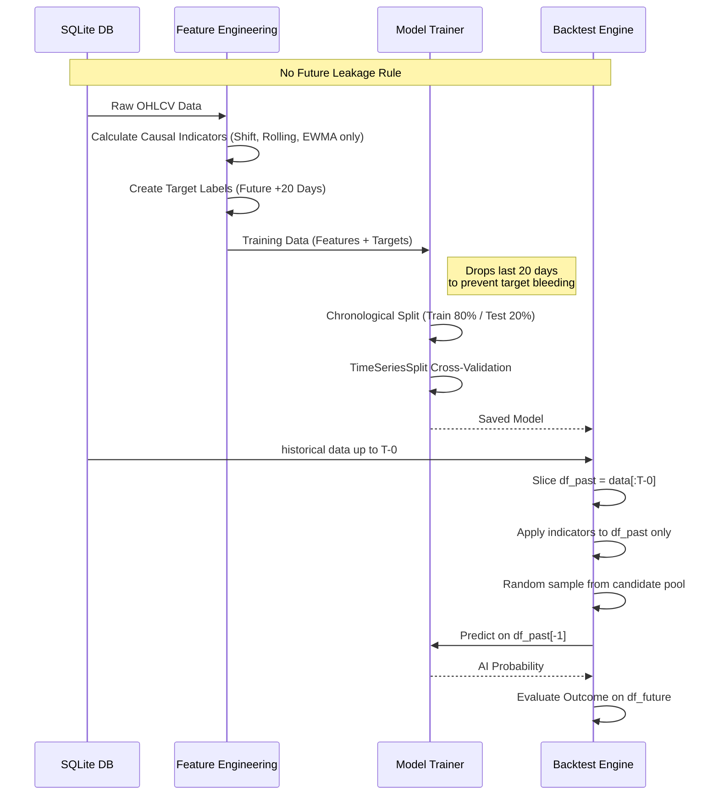

# SNIPER AI: Data Integrity & Anti-Leakage Safeguards

This document outlines the architectural safeguards built into the core AI training and backtesting pipelines to prevent **Look-Ahead Bias** (偷看未來資料) and ensure all performance metrics are statistically genuine.

## Core Principle: Strict Temporal Boundaries

The golden rule of the Sniper system is that **no future data can influence past decisions**.

## Matrix of Safeguards

### 1. Training Pipeline (`core/ai/trainer.py`)

| Risk | Mitigation Strategy | Implementation Details |
|------|-----------------------|------------------------|
| **Label Bleeding** (Using recent data where outcomes are unknown) | Truncation of terminal data | Removes the last `PRED_DAYS` (20 days) from the training set entirely (`df_clean.iloc[:-PRED_DAYS]`). |
| **Chronological Leakage** (Training on future, testing on past) | Strict Chronological Split | Sorts all aggregated data by date. Uses `split_idx = int(len(X_all) * 0.8)`. Test set is exclusively future data relative to train set. |
| **Cross-Validation Bias** (K-Fold shuffling leaks future states) | `TimeSeriesSplit` | Uses forward-chaining CV instead of K-Fold. Fold 1 trains on `T1`, validates on `T2`. Fold 2 trains on `T1+T2`, validates on `T3`. |
| **Imputation Leakage** (Filling missing data using future averages) | Forward-Fill Only | `df.ffill()` is strictly applied. `bfill()` is forbidden during training to prevent pulling future values into past technical indicators. |

### 2. Backtesting Pipeline (`backend/backtest.py`)

| Risk | Mitigation Strategy | Implementation Details |
|------|-----------------------|------------------------|
| **Selection Bias** (Backtesting only stocks that survived/succeeded) | Random Sampling pool | Candidate universe is selected via `random.seed(42)` and `random.sample()` from the entire DB pool, avoiding alphabetical or market-cap biases. |
| **Time-Machine Leakage** (AI calculating indicators on future price action) | Strict Data Slicing | `df_past = df_full.iloc[:entry_idx + 1]`. The AI prediction function strictly receives data *up to and including the entry date*. |
| **Outcome Peeking** (Using future highest-high retrospectively) | Forward Walk Evaluation | `df_future` is evaluated chronologically step-by-step. If a `-5%` stop-loss is hit on day 2, it registers a `STOP` even if day 10 hits `+15%`. |

### 3. Feature Engineering (`core/indicators_v2.py`)

Every technical indicator used by the AI model is strictly causal.

- Using standard Pandas `rolling(window=X)` and `ewm()`.
- No centered rolling averages.
- Target labels (Class 0, 1, 2) are calculated dynamically inside `prepare_features` and explicitly stripped before any prediction happens.

## Verification

If you observe "beautiful" backtest numbers (high win rates or R/R ratios), they are a product of:

1. **The Strict Base Rules**: High initial filtering via AI Thresholds.
2. **True Out-of-Sample generalization**: The AI successfully learned persistent momentum/squeeze patterns.

*To verify locally, run the backtest module on different `days_ago` timeframes. The consistent profit factors validate the lack of look-ahead bias.*
