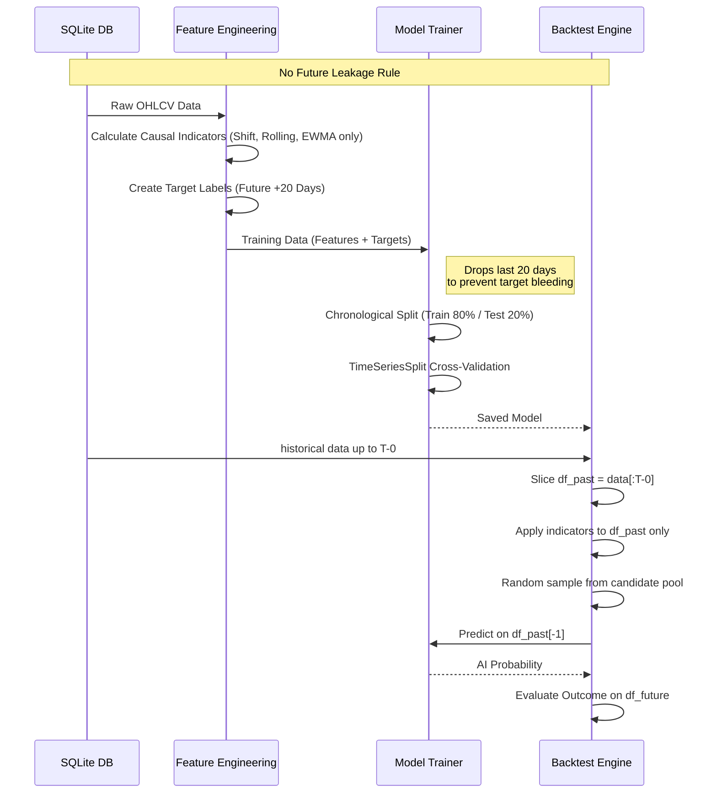

# SNIPER AI: Data Integrity & Anti-Leakage Safeguards

This document outlines the architectural safeguards built into the core AI training and backtesting pipelines to prevent **Look-Ahead Bias** (偷看未來資料) and ensure all performance metrics are statistically genuine.

## Core Principle: Strict Temporal Boundaries

The golden rule of the Sniper system is that **no future data can influence past decisions**.

```mermaid
sequenceDiagram
    participant DB as SQLite DB
    participant FT as Feature Engineering
    participant TR as Model Trainer
    participant BT as Backtest Engine

    Note over DB,BT: No Future Leakage Rule
    DB->>FT: Raw OHLCV Data
    FT->>FT: Calculate Causal Indicators (Shift, Rolling, EWMA only)
    FT->>FT: Create Target Labels (Future +20 Days)
    FT->>TR: Training Data (Features + Targets)
    Note right of TR: Drops last 20 days <br>to prevent target bleeding
    TR->>TR: Chronological Split (Train 80% / Test 20%)
    TR->>TR: TimeSeriesSplit Cross-Validation
    TR-->>BT: Saved Model
    
    DB->>BT: historical data up to T-0
    BT->>BT: Slice df_past = data[:T-0]
    BT->>BT: Apply indicators to df_past only
    BT->>BT: Random sample from candidate pool
    BT->>TR: Predict on df_past[-1]
    TR-->>BT: AI Probability
    BT->>BT: Evaluate Outcome on df_future
```

## Matrix of Safeguards

### 1. Training & Deployment Pipeline (`core/ai/trainer.py` & `backend/manage_models.py`)

| Risk | Mitigation Strategy | Implementation Details |
|------|-----------------------|------------------------|
| **Label Bleeding** (Using recent data where outcomes are unknown) | Truncation of terminal data | Removes the last `PRED_DAYS` (20 days) from the training set entirely (`df_clean.iloc[:-PRED_DAYS]`). |
| **Chronological Leakage** (Training on future, testing on past) | Date-based embargo of `PRED_DAYS` **trading days** | `core/ai/trainer.py:chronological_split`. The cut date is taken at the 80% row position; the training set ends `PRED_DAYS` entries earlier in the panel's own **sorted unique dates**, and the test set starts at the cut date. Verify with `pytest tests/test_core/test_embargo.py`, whose every assertion is about distinct dates. **History**: until 2026-09-02 this row described `iloc[:split_idx - PRED_DAYS]`, which embargoed *rows*. On a stacked panel one date is N rows, so at 92 tickers that separated train from test by **0 trading days** — every `oos_metrics` produced before then is contaminated. See `docs/specs/date-based-train-test-embargo.md`. |
| **Cross-Validation Bias** (K-Fold shuffling leaks future states) | Forward-chaining `TimeSeriesSplit` with a **date-scaled** gap | `gap = PRED_DAYS x max_rows_per_date`, because scikit-learn counts `gap` in **samples**, not days. The max (not the mean) is used so the gap is guaranteed to span at least `PRED_DAYS` distinct dates on an uneven panel. This CV is **diagnostic only** — each fold's classifier is fit, its accuracy printed, then discarded — so when a short panel cannot host the folds it degrades (3 → 2 → skipped) rather than failing the run; the holdout embargo above is the actual guarantee. **History**: until 2026-09-02 this was a bare `gap=20`, which on a stacked panel spanned a fraction of one day. |
| **Imputation Leakage** (Filling missing data using future averages) | Forward-Fill Only | `df.ffill()` is strictly applied. `bfill()` is forbidden during training to prevent pulling future values into past technical indicators. Warmup indicator rows are dropped completely via `dropna` instead of zero-biasing. |
| **Binary Model Corruption** (Interrupted model saves/activations) | Atomic Writes & Switches | All serialized PKL models and sidecar files (`.sha256`, `.sig`) are written to temporary files inside the target directory first, then swapped instantly using `os.replace`. Prevents partial-write file corruption during CLI or training process interruptions. |

### 2. Backtesting Pipeline (`backend/backtest.py`)

| Risk | Mitigation Strategy | Implementation Details |
|------|-----------------------|------------------------|
| **Ordering / market-cap bias** in candidate selection | Deterministic random sampling | `backend/backtest.py:79-82` uses `random.seed(42)` + `random.sample()` so the candidate pool is not alphabetical or market-cap ordered, and is reproducible across runs. |
| **Survivorship bias** (backtesting only stocks that still exist) | **NOT MITIGATED — known limitation** | `backend/backtest.py:66` draws candidates from `get_all_tw_stocks()`, which is **today's** listed TWSE/TPEX set. Delisted names are structurally absent, and no listing/delisting dates are stored anywhere — the universe cache is `{code, name, market, kind}` — so there is no point-in-time universe to draw from. Results are therefore biased **upward** by an unmeasured amount. **History**: until 2026-09-02 this row claimed the random sampling above mitigated survivorship. It does not: sampling from a survivor-only universe is unbiased *within* survivors and says nothing about the names that left. |
| **Time-Machine Leakage** (AI calculating indicators on future price action) | Strict Data Slicing | `df_past = df_full.iloc[:entry_idx + 1]`. The AI prediction function strictly receives data *up to and including the entry date*. |
| **Outcome Peeking** (Using future highest-high retrospectively) | Forward walk **plus** achievable-fill settlement | `df_future` is walked chronologically: a stop hit on day 2 registers a `STOP` even if day 10 reaches `+15%`. Separately, the **exit price** is one an order could have received — a target touch settles at `target_gain`, a stop touch at `-stop_loss`, with a gap-through bar filling at its open, clamped inside `[low, high]` (`backend/backtest.py:219-247`). **History**: until 2026-09-02 the forward walk was correct but the price booked was the session **high** on a win and the session **low** on a loss — a one-directional inflation of every magnitude-based metric. See `docs/specs/backtest-settlement-realism.md`. |

### 3. Feature Engineering (`core/indicators_v2.py`)

Every technical indicator used by the AI model is strictly causal.

- Using standard Pandas `rolling(window=X)` and `ewm()`.
- No centered rolling averages.
- Target labels (Class 0, 1, 2) are calculated dynamically inside `prepare_features` and explicitly stripped before any prediction happens.

## Verification

If you observe "beautiful" backtest numbers, **do not read them as evidence of skill.** The measured
reality on this project's own data is that the model is weak: with a clean embargo, StrongBuy
precision sits at or *below* the test-split base rate (`docs/specs/ml-label-oos-evaluation.md`
§Re-measurement). A high win rate on a small, filtered, survivor-only sample is the expected shape of
that, not a contradiction of it.

**How to actually falsify a look-ahead claim.** Running the backtest at several `days_ago` values and
observing consistent profit factors proves nothing — consistency is not a leakage test, and both
runs would inherit the same leak. A real control is a **label shuffle**: retrain with `y` randomly
permuted and re-run the backtest. A pipeline free of leakage collapses toward a profit factor of ~1;
one that retains a leak keeps scoring well on labels that carry no information.

**What is still not protected**, stated so the next reader does not have to discover it:

- **The backtest scores the production model over a window that model was trained on.**
  `backend/backtest.py:176` calls `predict_prob(..., version=version)` with the deployed model, which
  `core/ai/trainer.py` fit on all rows up to today. For `days_ago=30` this measures in-sample recall.
  Tracked as backlog #3.
- **Survivorship** — see the table above. Unmitigated.
- **Model rotation ranks profit factors measured under different settlement rules** (backlog #4), and
  **`oos_metrics` are attributed to the split model rather than the shipped full-data refit**
  (backlog #5). A `models_history.json` entry **without** an `embargo` key predates 2026-09-02 and its
  metrics are contaminated by construction.
- **Price basis can be mixed within one ticker's series** — the yfinance path writes back-adjusted
  closes, the TWSE/TPEX bulk path writes raw ones, and `stock_history` has no `source` column to tell
  them apart. Deferred; detail in `docs/specs/_raw-intake.md`.
