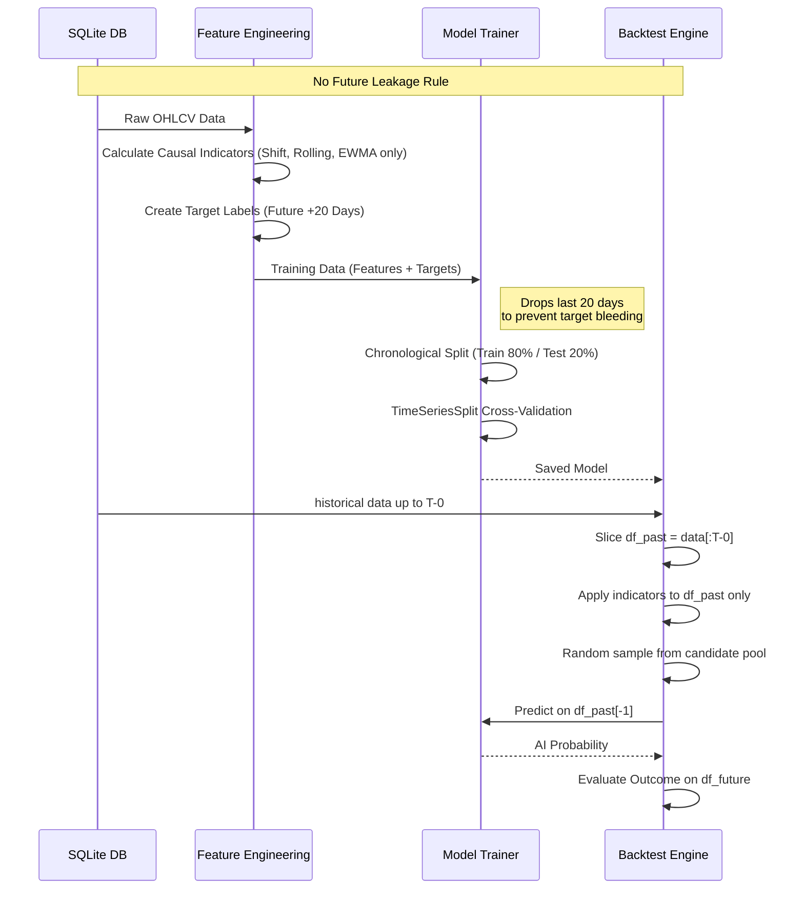

# SNIPER AI: Data Integrity & Anti-Leakage Safeguards

This document outlines the architectural safeguards built into the core AI training and backtesting pipelines against **Look-Ahead Bias** (偷看未來資料).

> [!IMPORTANT]
> **Scope of this document.** It records which safeguards exist, which do **not**, and where each is
> implemented — it is not a claim that the metrics are sound. Several known biases are currently
> **unmitigated**, and metrics produced before 2026-09-02 are contaminated by a defective embargo.
> Read **§Verification** at the end before trusting any number, and treat every row below as
> falsifiable at the `file:line` it cites.

## Core Principle: Strict Temporal Boundaries

The intent of the Sniper system is that no future data influences past decisions. The rows below
record how far that intent is actually implemented, and §Verification records where it is not.

```mermaid
sequenceDiagram
    participant DB as SQLite DB
    participant FT as Feature Engineering
    participant TR as Model Trainer
    participant BT as Backtest Engine

    Note over DB,BT: No Future Leakage Rule
    DB->>FT: Raw OHLCV Data
    FT->>FT: Calculate Causal Indicators (Shift, Rolling, EWMA only)
    FT->>FT: Create Target Labels (Future +20 Days)
    FT->>TR: Training Data (Features + Targets)
    Note right of TR: Drops last 20 days <br>to prevent target bleeding
    TR->>TR: Chronological Split (Train 80% / Test 20%)
    TR->>TR: TimeSeriesSplit Cross-Validation
    TR-->>BT: Saved Model
    
    DB->>BT: historical data up to T-0
    BT->>BT: Slice df_past = data[:T-0]
    BT->>BT: Apply indicators to df_past only
    BT->>BT: Random sample from candidate pool
    BT->>TR: Predict on df_past[-1]
    TR-->>BT: AI Probability
    BT->>BT: Evaluate Outcome on df_future
```

## Matrix of Safeguards

### 1. Training & Deployment Pipeline (`core/ai/trainer.py` & `backend/manage_models.py`)

| Risk | Mitigation Strategy | Implementation Details |
|------|-----------------------|------------------------|
| **Label Bleeding** (Using recent data where outcomes are unknown) | Truncation of terminal data | `core/ai/trainer.py:190` drops the last `PRED_DAYS` (20) rows, whose barriers have not resolved yet. Rows here really are days: `prepare_features` runs **per ticker** before `pd.concat` (`core/ai/trainer.py:327`), so this is not a repeat of the row-vs-day confusion that broke the embargo row above. |
| **Chronological Leakage** (Training on future, testing on past) | Date-based embargo of `PRED_DAYS` **trading days** | `core/ai/trainer.py:chronological_split`. The cut date is taken at the 80% row position; the training set ends `PRED_DAYS` entries earlier in the panel's own **sorted unique dates**, and the test set starts at the cut date. Verify with `pytest tests/test_core/test_embargo.py`, whose **gap** assertions are about distinct dates rather than row counts (the file also asserts row/sample arithmetic on the CV gap itself). **History**: until 2026-09-02 this row described `iloc[:split_idx - PRED_DAYS]`, which embargoed *rows*. On a stacked panel one date is N rows, so at 92 tickers that separated train from test by **0 trading days** — every `oos_metrics` produced before then is contaminated. See `docs/specs/date-based-train-test-embargo.md`. |
| **Cross-Validation Bias** (K-Fold shuffling leaks future states) | Forward-chaining `TimeSeriesSplit` with a **date-scaled** gap | `gap = PRED_DAYS x max_rows_per_date`, because scikit-learn counts `gap` in **samples**, not days. The max (not the mean) is used so the gap is guaranteed to span at least `PRED_DAYS` distinct dates on an uneven panel. This CV is **diagnostic only** — each fold's classifier is fit, its accuracy printed, then discarded — so when a short panel cannot host the folds it degrades (3 → 2 → skipped) rather than failing the run; the holdout embargo above is the control that is actually enforced. Neither is a guarantee that no leakage of any kind remains — they bound train/test **dates**, and say nothing about overlapping labels across tickers or about feature construction. **History**: until 2026-09-02 this was a bare `gap=20`, which on a stacked panel spanned a fraction of one day. |
| **Imputation Leakage** (Filling missing data using future averages) | Forward-fill during training; **nothing is filled for prediction** | `core/ai/trainer.py:182`: training applies `ffill()` only, and warm-up rows are dropped via `dropna` (`:199`) rather than zero-filled. The prediction branch now fills nothing at all. **History**: until 2026-09-02 prediction ran `ffill().bfill()` and then an unconditional `fillna(0)`. The `bfill()` could never reach the prediction row (it is the last one), but the `ffill()` could -- substituting yesterday's indicator for today's whenever today's was uncomputable. Measured on the 92-ticker dev panel: **0** latest rows depended on it. |
| **Invented model inputs** (scoring a stock on a value that was never computed) | Refuse to predict rather than substitute | `core/ai/predictor.py` checks every `FEATURE_COLS` value on the prediction row with `uncomputable_features()` (`core/ai/common.py`) and returns `None` -- so `ai_prob` is `NULL` and the UI shows N/A with a reason -- when any is NaN or +/-inf. The same refusal covers a model whose `feature_names_in_` asks for a column the frame does not have, which used to be invented via `reindex(fill_value=0)`. **History**: until 2026-09-02 a ticker with 120-249 rows was scored with `dist_sma240` and `sma240_slope` at `0`. That is not a blank: on ticker 2330's real last trading day the true `dist_sma240` was **+0.3429** (34.3% above its annual mean) and the substitution reported **0.0** -- *exactly on the mean*. See `docs/specs/unknown-is-not-zero-ml-features.md`. |
| **Substitutions that remain** (named, not fixed) | **NOT MITIGATED — known limitation** | Three fills survive this change, all outside the model's input row. (1) `core/rise_score_v2.py:38,46,53` zero-fill the three technical sub-scores, so a stock whose factors cannot be computed is shown a score built from zeros rather than N/A -- this is GH #8's territory and is tracked in `docs/specs/_product-backlog.md`. (2) `backend/services/legacy_service.py` and `backend/recalculate.py` zero-fill the frame for the JSON payload; the model is now handed the unfilled frame (`df_for_model`), but the **displayed** technical numbers still rest on that fill. (3) `core/ai/trainer.py:371` maps any surviving `inf` in the training matrix to `0` -- `dropna` removes NaN rows but not infinities. |
| **Binary Model Corruption** (Interrupted model saves/activations) | Atomic writes and switches | `core/ai/trainer.py:538-555`: PKL models and their `.sha256` / `.sig` sidecars are written to temp files inside the target directory, then swapped with `os.replace`, so an interrupted save cannot leave a truncated artifact that the predictor would load. |

### 2. Backtesting Pipeline (`backend/backtest.py`)

| Risk | Mitigation Strategy | Implementation Details |
|------|-----------------------|------------------------|
| **Ordering / market-cap bias** in candidate selection | Deterministic random sampling | `backend/backtest.py:192` uses `random.seed(42)` + `random.sample()` so the candidate pool is not alphabetical or market-cap ordered, and is reproducible across runs. |
| **Cross-sectional misalignment** (a "portfolio" assembled from different days) | Single `as_of` date per run | Entry was `len(df) - days_ago`, a **row** offset -- and row counts differ per ticker, so a ticker with halts or partial backfill entered on a different **day** while the summary reported one date taken from `top_picks[0]`. Every candidate now enters on its last bar at or before one `as_of` drawn from the table's own trading calendar, or leaves the run and is counted (`excluded_no_data_at_as_of`, `excluded_no_price_rows`). See `docs/specs/backtest-temporal-guard.md`. |
| **Survivorship bias** (backtesting only stocks that still exist) | **NOT MITIGATED — known limitation** | `backend/backtest.py:179` draws candidates from `get_all_tw_stocks()`, which is **today's** listed TWSE/TPEX set; the `:67-73` fallback reads `stock_scores` from the DB, which is also survivor-only. Delisted names are structurally absent, and no listing/delisting dates are stored anywhere — the universe cache is `{code, name, market, kind}` — so there is no point-in-time universe to draw from. Results are therefore biased **upward** by an unmeasured amount. **History**: until 2026-09-02 this row claimed the random sampling above mitigated survivorship. It does not: sampling from a survivor-only universe is unbiased *within* survivors and says nothing about the names that left. |
| **Time-Machine Leakage** (AI calculating indicators on future price action) | Strict Data Slicing | `df_past = df_full.iloc[:entry_idx + 1]`. The AI prediction function strictly receives data *up to and including the entry date*. |
| **Outcome Peeking** (Using future highest-high retrospectively) | Forward walk **plus** achievable-fill settlement | `df_future` is walked chronologically: a stop hit on day 2 registers a `STOP` even if day 10 reaches `+15%`. Separately, the **exit price** is one an order could have received — a target touch settles at `target_gain`, a stop touch at `-stop_loss`, with a gap-through bar filling at its open, clamped inside `[low, high]` (`backend/backtest.py` — the clamp at `:376`, the target branch at `:422`). **History**: until 2026-09-02 the forward walk was correct but the price booked was the session **high** on a win and the session **low** on a loss — a one-directional inflation of every magnitude-based metric. See `docs/specs/backtest-settlement-realism.md`. |

### 3. Feature Engineering (`core/indicators_v2.py`)

Every technical indicator used by the AI model is strictly causal.

- Using standard Pandas `rolling(window=X)` and `ewm()`.
- No centered rolling averages.
- Target labels (Class 0, 1, 2) are calculated dynamically inside `prepare_features` and explicitly stripped before any prediction happens.

## Verification

If you observe "beautiful" backtest numbers, **do not read them as evidence of skill.** The measured reality on this project's own data is that the model is weak, and the two runs recorded in
`docs/specs/ml-label-oos-evaluation.md` §Re-measurement say it slightly differently — both are reported
here rather than blended into one flattering or one damning sentence:

- **Run B** (`scripts/eval_label_modes.py`, `ml-label-oos-evaluation.md:78-83`): StrongBuy precision
  carries only ~**1.2×** lift over the test-split prevalence under the shipped `atr` labels
  (0.365 against 31.0%), and **Buy precision is below chance** (0.131 against 15.6%).
- **Run A** (the controlled both-splits panel, recorded in `docs/specs/_product-backlog-honest-metrics-2026-09-02.md:62`):
  StrongBuy precision **0.3454 against a 0.3512 prevalence — below the base rate**.

A high win rate on a small, filtered, survivor-only sample is the expected shape of a weak model, not a
contradiction of it.

**How to actually falsify a look-ahead claim.** Running the backtest at several `days_ago` values and
observing consistent profit factors proves nothing — consistency is not a leakage test, and both
runs would inherit the same leak. A real control is a **label shuffle**: retrain with `y` randomly
permuted and re-run the backtest. A pipeline free of leakage collapses toward a profit factor of ~1;
one that retains a leak keeps scoring well on labels that carry no information. **This ships no flag
today** — `grep -rn "shuffle\|permut" core/ai/ scripts/` returns nothing — so running it means editing
`core/ai/trainer.py` locally to permute `y_train_full` before the fit. Said plainly rather than
implying a command exists.

**What is still not protected**, stated so the next reader does not have to discover it:

- **The backtest scores the production model over a window that model was trained on.**
  `backend/backtest.py:333` calls `predict_prob(..., version=version)` with the deployed model,
  which `core/ai/trainer.py` fit on all rows up to today, so `days_ago=30` measures in-sample recall.
  **Now DISCLOSED, not fixed**: the response carries `model_temporal_scope`, and the Backtest page
  and Strategy Lab say in words that the numbers are hindsight. Actually removing the leak needs an
  as-of model trained per window, which no item in this epic attempts.
- **Survivorship** — see the table above. Unmitigated.
- **Model rotation no longer ranks profit factors measured under different settlement rules** (fixed 2026-09-02). It compares only entries sharing a `settlement` marker and benchmark window, and **protects** everything else from deletion rather than sorting it last, so the model store may exceed `MAX_SAVED_MODELS`. **Still true**: the rotation benchmark is scored on a window inside the training data (`backtest_30d.in_sample: true`) — it is a relative yardstick between models, not a measure of live skill. A genuinely out-of-sample rotation score needs an as-of model per window (backlog #3).
- **`oos_metrics` still describe the 80%-split ensemble, not the shipped full-data refit** — but this
  is now *recorded and disclosed* rather than implied: the entry carries
  `oos_metrics_scope: "split_model"`, and the transparency panel says so. The measurement itself is
  unchanged; what changed is that it no longer reads as the shipped model's score.
- **Precision is now reported as lift over the test-split base rate** (`oos_metrics.lift_strong` /
  `lift_buy`), because precision alone is unreadable without its denominator, and the distribution
  that used to sit beside it was the **train** split. `get_model_health` returns `degraded` when the
  lift is at or below 1.0, when the entry has no `embargo` key, or when it cannot evaluate the entry
  at all — it fails toward disclosure. A `models_history.json` entry **without** an `embargo` key
  predates 2026-09-02 and its metrics are contaminated by construction.
- **Price basis can be mixed within one ticker's series** — the yfinance path writes back-adjusted
  closes, the TWSE/TPEX bulk path writes raw ones, and `stock_history` has no `source` column to tell
  them apart. Deferred; detail in `docs/specs/_raw-intake.md`.
